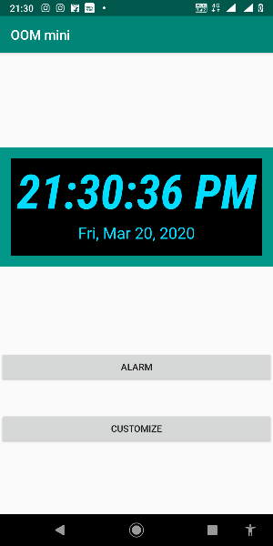
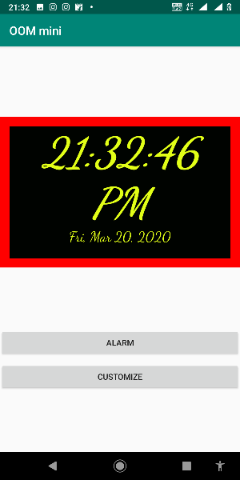
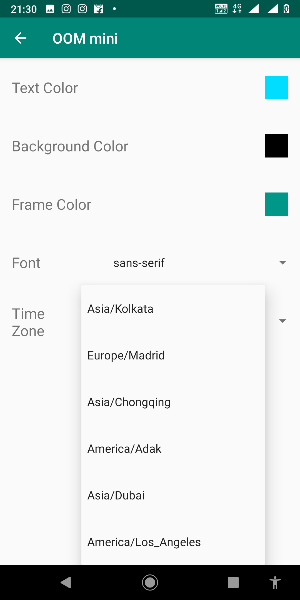
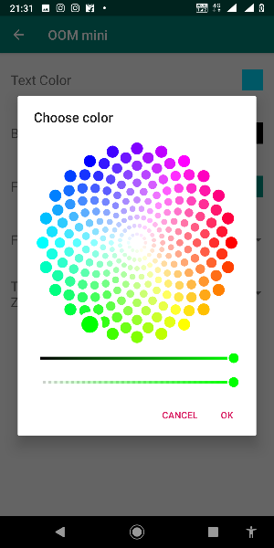
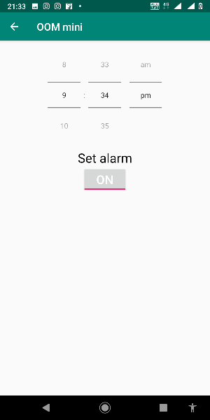

# Digital Clock
## OOM Mini-Project

This is a Digital Clock android application created as mini project
of Object Oriented Methodologies under instructor O.P.Vyas at
Indian Institute of Information Technology, Allahabad.

### Key features of the app includes:

- Uses device's user-defined android clock widget displays time accordingly.
- User can choose a different time-zone from the given list in the app.
- User can choose different font for the clock.
- User can change the color of text, background and frame of the clock using the embedded Color Picker.
- User can set alarm (Alarm tune will be fetched from user selected tune in the device settings).
 
Here are some screenshots of app made in java.

  
  
 

### Authors
- [Shreyansh Sahu](https://github.com/23nobody)

### You can have a look at:
- [Class Diagram](ClassDiagram.pdf) 
- [Use Case](UseCase.pdf) 
- [CRC](CRC.pdf) 

### HOW TO INSTALL

If you have Andorid Studio simply open the project, connect your mobile and install.

Else

Copy "app-debug.apk" in your android mobile and install it from pakage installer in your handset.
